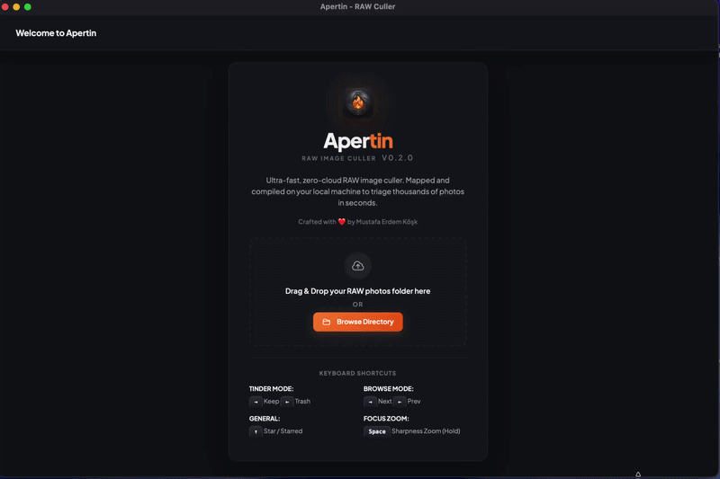

<div align="center">


# Apertin

**Ultra-fast, zero-cloud RAW image culler for photographers who shoot thousands.**

[](LICENSE)
[](https://tauri.app)
[](https://www.rust-lang.org/)
[](https://svelte.dev/)
[](https://www.apple.com/macos/)
[](https://www.microsoft.com/windows/)
[](https://www.kernel.org/)

> Crafted with ❤️ by [Mustafa Erdem Köşk](https://github.com/mek)

<br/>



</div>

---

## ✦ What is Apertin?

Apertin is a **local-first, blazing-fast RAW image culling app** built for photographers who come back from a shoot with 400+ RAW files and need to triage them in minutes — not hours.

It works like a card-swipe workflow for your photos. Swipe right to keep, left to trash. Every operation runs entirely on your machine — **no cloud uploads, no subscriptions, no waiting**.

The core engine is written in **Rust** and uses memory-mapped file I/O to extract embedded JPEG previews directly from RAW files at native speed. Your full-resolution RAW files never have to be decoded during culling.

---

## ⚡ Key Features

| Feature | Details |
|---|---|
| 🚀 **Zero-decode preview extraction** | Reads the embedded JPEG directly from RAW binary — no full decode needed |
| 🔥 **Swipe Mode** | Keyboard-driven keep/trash workflow with animated card transitions |
| ↩️ **Undo** | Instantly reverse the last keep/trash/star decision with `⌘Z` / `Ctrl+Z` or the dock button — works even from the summary screen |
| 👁️ **Browse Mode** | Classic gallery browser with instant prev/next navigation |
| 📂 **Grid Mode** | Full-screen interactive lazy-loaded thumbnail view of files with status badges |
| 📊 **Split Compare View** | Compare up to 4 images side-by-side with synchronized zoom/pan |
| 📈 **RGB & Luma Histogram** | Live-rendered high-performance exposure graphs inside EXIF panel |
| ⚡ **XMP Sidecar Export** | Toggle to write ratings/reject tags directly to `.xmp` files, leaving originals in place |
| 🎨 **Adobe Lightroom Link** | Right-click sidebar files to reveal in Finder or open directly in Lightroom Classic |
| 🔍 **Focus Check Zoom** | Press `Space` to enter pixel-level zoom mode across all images (including inside Grid Mode) |
| ⭐ **Star Rating** | Mark hero shots with `↑` for selective editing |
| 🔗 **Smart Grouping** | Automatically cluster burst shots and similar scenes before you cull |
| 📊 **EXIF Sidebar** | Camera, lens, shutter, aperture, ISO, focal length at a glance |
| 🗂️ **macOS "Open With"** | Right-click any folder in Finder → Open With → Apertin |
| 🖱️ **Drag & Drop** | Drag a folder onto the app window to start instantly |
| 🗑️ **OS Trash** | Trashed files go to your system recycle bin |
| ✅ **Selected_to_Edit export** | Kept files moved to `Selected_to_Edit/` ready for Lightroom/Capture One |
| 💾 **Session persistence** | Progress is saved per folder — close and resume at any time |
| 🌑 **Dark mode only** | Premium dark UI — built for low-light post-production environments |
| 🔒 **Fully local** | Zero network requests, zero telemetry, zero cloud |

---

## 📸 Supported Formats

| Format | Camera Brand |
|---|---|
| `.ARW` | Sony (α series) |
| `.CR3` / `.CR2` | Canon (EOS series) |
| `.NEF` | Nikon |
| `.RAF` | Fujifilm |
| `.DNG` | Adobe / Leica / DJI |
| `.ORF` | Olympus |
| `.RW2` | Panasonic |
| `.PEF` | Pentax |
| `.HEIC` / `.HEIF` | iOS / Modern mobile |
| `.JPG` / `.JPEG` | Any camera |
| `.PNG` | Any source |

---

## 🎯 Workflow

```
📁 Open Folder
    │
    ▼
⚡ Rust scans directory & extracts embedded previews (parallel, memory-mapped)
    │
    ▼
🔥 Swipe Mode
    ├── → Keep    (moves to Selected_to_Edit/)
    ├── ← Trash   (sent to OS recycle bin)
    └── ↑ Star    (moves to Starred/)
    │
    ▼
📋 Review Decisions
    ├── Inspect thumbnails
    ├── Restore from trash
    └── Demote keeps to trash
    │
    ▼
✅ Apply — done. Open Selected_to_Edit/ in Lightroom.
```

---

## ⌨️ Keyboard Shortcuts

### Swipe Mode
| Key | Action |
|---|---|
| `→` | Keep image |
| `←` | Trash image |
| `↑` | Toggle star |
| `⌘Z` / `Ctrl+Z` | Undo last decision |
| `Space` | Toggle focus zoom (persists across images) |

### Browse Mode
| Key | Action |
|---|---|
| `→` | Next image |
| `←` | Previous image |
| `↑` | Toggle star |
| `⌘Z` / `Ctrl+Z` | Undo last decision |
| `Space` | Toggle focus zoom |

### Grid Mode
| Key | Action |
|---|---|
| `Space` | Fullscreen sharpness zoom of selected thumbnail |
| `Double Click` | Select thumbnail and switch to Browse Mode |
| `Right Click` | Open file context menu (Lightroom / Finder Reveal) |

---

## 🔗 Smart Grouping

Apertin can automatically group similar photos before you start culling, so you can make one keep/trash decision for an entire burst instead of reviewing each frame individually.

### Two grouping modes

**⏱ Time-based grouping** runs entirely in the browser — no Rust invocation needed. It reads the `DateTimeOriginal` EXIF field from each photo and clusters consecutive shots taken within a configurable time window.

| Preset | Gap | Typical use |
|---|---|---|
| 30 s | 30 seconds | Tight bursts, bracketed exposures |
| 2 min | 2 minutes | Scene changes during a walk-around |
| 5 min | 5 minutes | Different locations in the same session |

**⬡ Visual similarity grouping** is powered by a Rust backend algorithm that analyses the pixel content of each photo's embedded preview thumbnail.

### pHash algorithm (DCT-based perceptual hash)

Each photo is reduced to a 64-bit fingerprint using the following pipeline:

```
Embedded JPEG thumbnail (first 2 MB of file, memory-mapped)
        │
        ▼
  Resize to 32 × 32 (Triangle / bilinear filter)
        │
        ▼
  Convert to grayscale (luma)
        │
        ▼
  Separable 2-D DCT-II
  (row-wise 1-D DCT, then column-wise 1-D DCT)
        │
        ▼
  Extract top-left 8 × 8 low-frequency block
  (these coefficients encode global scene structure —
   noise, blur, and minor exposure changes live in the
   high-frequency region that is discarded here)
        │
        ▼
  64-bit hash: bit i = 1 if coeff[i] > median(all 64 coeffs)
```

Two hashes are compared with **Hamming distance** (number of differing bits out of 64). Lower distance = more visually similar.

| Preset | Hamming ≤ | What it matches |
|---|---|---|
| Burst | 6 | Near-identical frames, only shutter timing differs |
| Normal | 10 | Same scene with varying exposure, slight reframe |
| Loose | 15 | Similar subject from a different angle |

### Why pHash over dHash?

The naïve approach — **dHash** (difference hash) — compares adjacent pixel brightness at 9×8 resolution. It is extremely sensitive to exposure changes, focus variance, and even minor reframing, which causes burst shots to be assigned different hashes and unrelated photos to accidentally collide.

pHash's **DCT low-frequency coefficients** are robust because:
- Exposure / brightness shifts are low-amplitude in the DC term (coeff[0,0]) and handled by the median normalisation
- Noise and blur are high-frequency — they are discarded by taking only the 8×8 low-frequency block
- Global scene composition (the actual "content") is captured in the 8×8 block regardless of minor photographic variations

### Complete-linkage clustering (no bridge problem)

Once all hashes are computed (in parallel via Rayon), they are clustered using **complete-linkage**:

> A photo joins an existing group only if its Hamming distance to **every current member** of that group is within the threshold.

This prevents the *bridge problem* that plagues single-linkage clustering:

```
Single-linkage (old):   A ≈ B  and  B ≈ C  →  A + B + C same group  ✗
                        (even if A and C are completely different scenes)

Complete-linkage (new): A ≈ B  and  B ≈ C  but  A ≇ C
                        →  {A, B} and {C} are separate groups         ✓
```

Groups are anchored at the earliest member's position in the file list. All members are rendered consecutively in the sidebar, so you can immediately see the cluster and decide with a single keep/trash action.

---

## 🏗️ Architecture

Apertin is built on a **Rust + Svelte + Tauri** stack. The separation of concerns is clean:

```
┌─────────────────────────────────────────┐
│           Svelte Frontend               │
│  - State machine (welcome/cull/summary) │
│  - Card stack animations                │
│  - Keyboard event bus                   │
│  - Blob URL preview rendering           │
└────────────────┬────────────────────────┘
                 │ Tauri IPC (invoke)
┌────────────────▼────────────────────────┐
│           Rust Backend                  │
│  - scan_directory (parallel WalkDir)    │
│  - parse_raw_file (EXIF + preview)      │
│  - get_raw_preview (mmap byte read)     │
│  - execute_culling_actions (fs moves)   │
│  - analyze_groups (pHash + clustering)  │
│  - select_folder (rfd native dialog)    │
│  - get_initial_path (CLI arg / Open With)│
└─────────────────────────────────────────┘
```

### Why Rust for the core?

- RAW files range from 20MB–100MB each
- Parallel preview extraction via **Rayon** (one thread per file)
- Memory-mapped I/O means preview bytes are read without loading the full file
- Result: 400 Sony ARW files scanned in ~1.2 seconds on M-series Mac

---

## 🛠️ Installation

### Prerequisites

- [Rust](https://rustup.rs/) (stable toolchain)
- [Node.js](https://nodejs.org/) 18+
- [Tauri CLI v2](https://tauri.app/start/prerequisites/)

```bash
# macOS dependencies (if not already installed)
xcode-select --install
```

### macOS — First Launch (Gatekeeper)

Because Apertin is not yet notarised with an Apple Developer certificate, macOS will show:

> *"Apple could not verify 'Apertin' is free of malware…"*

**One-time fix — run this in Terminal:**

```bash
xattr -cr /Applications/Apertin.app
```

Then double-click the app normally. macOS will not ask again.

> **Tip:** If you haven't moved the app to `/Applications` yet, drag the `.app` from the mounted `.dmg` into Terminal instead of typing the path.

### Windows — First Launch (SmartScreen)

Because the installer is not yet signed with an EV certificate, Windows SmartScreen may show *"Windows protected your PC."*

**One-time fix:** click **More info → Run anyway**. Right-clicking a RAW file → **Open with → Apertin** opens its folder ready to cull, and **Reveal in Explorer** highlights the file directly.

### Linux — First Launch (AppImage)

Make the AppImage executable, then run it:

```bash
chmod +x Apertin_*.AppImage
./Apertin_*.AppImage
```

Or install the `.deb` on Debian/Ubuntu:

```bash
sudo dpkg -i apertin_*.deb
```

> On Linux, "Reveal in file manager" opens the containing folder (most desktops have no portable verb to pre-select a file).

---

### Clone & Run

```bash
git clone https://github.com/erdemkosk/apertin.git
cd apertin

npm install
npm run tauri dev
```

### Build for Production

```bash
npm run tauri build
```

The `.dmg` / `.app` bundle will appear in `src-tauri/target/release/bundle/`.

---

## 📂 Project Structure

```
apertin/
├── src/                    # Svelte frontend
│   ├── App.svelte          # Main application component
│   ├── global.css          # Design system (HSL tokens, glassmorphism)
│   ├── logo.png            # App icon
│   └── main.js             # Vite entry point
│
├── src-tauri/              # Rust backend
│   ├── src/
│   │   ├── main.rs         # Tauri commands + CLI arg handler
│   │   └── parser.rs       # RAW EXIF + preview parser
│   ├── Cargo.toml          # Rust dependencies
│   └── tauri.conf.json     # App config + macOS file associations
│
├── index.html              # App shell
├── vite.config.js          # Vite bundler config
└── package.json
```

---

## 🎨 Design Philosophy

Apertin's UI is built around a single principle: **the photo should fill your vision, not the interface**.

- **Dark-first**: Deep volcanic slate backgrounds (#07090e) chosen to match how photographers work in dimmed rooms
- **Glassmorphism panels**: Sidebar and EXIF strip use `backdrop-filter: blur()` so they feel like HUD overlays, not UI chrome
- **Amber accent system**: The `#f97316` amber is the only persistent color — everything else is monochrome or semantic (green = keep, red = trash, gold = star)
- **Plus Jakarta Sans**: Chosen over system fonts for its optical regularity and premium weight range
- **Zero animations for the photo itself** — only chrome elements animate. The photo is always sharp and still.

---

## 🔩 Tech Stack

| Layer | Technology | Why |
|---|---|---|
| Desktop shell | [Tauri 2](https://tauri.app) | Smaller than Electron, native webview, Rust backend |
| Frontend | [Svelte](https://svelte.dev) | Zero-overhead reactivity, no virtual DOM |
| Backend | [Rust](https://www.rust-lang.org/) | Memory safety + parallel performance |
| File walking | [walkdir](https://crates.io/crates/walkdir) | Efficient recursive directory traversal |
| Parallelism | [rayon](https://crates.io/crates/rayon) | Work-stealing thread pool for parallel file parsing |
| Image decode | [image](https://crates.io/crates/image) | JPEG decode for pHash thumbnail generation |
| OS trash | [trash](https://crates.io/crates/trash) | Cross-platform recycle bin integration |
| Native dialogs | [rfd](https://crates.io/crates/rfd) | Cross-platform Rust file dialog |
| Typography | [Plus Jakarta Sans](https://fonts.google.com/specimen/Plus+Jakarta+Sans) | Premium UI typeface |

---

## 🗺️ Roadmap

- [x] **Windows support** — `.msi` / `.exe` installers, Explorer "reveal & select", file associations
- [x] **Linux support** — `.deb` / `.AppImage` builds, GTK file dialog
- [x] **Collection view** — grid browse with zoom
- [x] **Virtualized grid** — windowed rendering keeps 5000+ file folders smooth
- [x] **Undo** — reverse the last keep/trash/star decision with `⌘Z` / `Ctrl+Z`
- [ ] **Color label system** — reject / 1-star / 2-star / pick
- [ ] **In-app auto-update** — one-click update via the Tauri updater
- [x] **Smart grouping** — pHash + complete-linkage clustering for burst and similar-scene detection
- [x] **XMP sidecar export** — write ratings back as metadata without moving files
- [x] **Lightroom Classic integration** — open Selected_to_Edit directly in catalog

---

## 🤝 Contributing

PRs are welcome. Open an issue to discuss large changes first.

```bash
# Run in dev mode
npm run tauri dev

# Lint frontend
npx svelte-check

# Check Rust
cd src-tauri && cargo check
```

---

## 📄 License

PolyForm Noncommercial 1.0.0 © Mustafa Erdem Köşk

---

<div align="center">

**If Apertin saved you an hour of culling, give it a ⭐**

*Built for photographers, by a photographer.*

</div>
